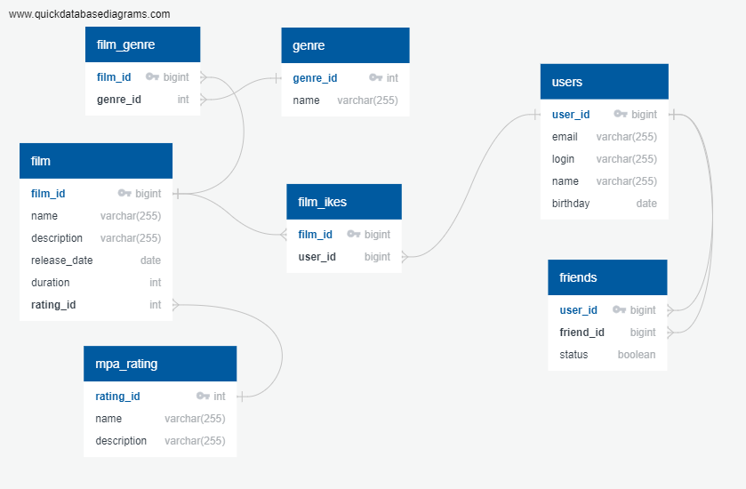

# Filmorate

Бэкенд для сервиса, который будет возвращать топ фильмов,
рекомендованных к просмотру.

## Возможности приложения:

* создание и обновление пользователей;
* добавление и удаление пользователей из списка друзей;
* добавление и обновление фильмов;
* добавление и удаление лайка фильму;
* получение наиболее популярных фильмов по количеству лайков

## Схема базы данных


## Примеры запросов:
* Получить список всех пользователей
```sql
SELECT *
FROM user;
```
* Получить названия всех фильмов
```sql
SELECT name
FROM film;
```
* Получить топ-10 фильмов 
```sql
SELECT f.name
FROM film AS f
LEFT JOIN film_likes AS fl ON f.film_id=fl.film_id
GROUP BY f.name
ORDER BY COUNT(fl.user_id) DESC
LIMIT 10;
```

